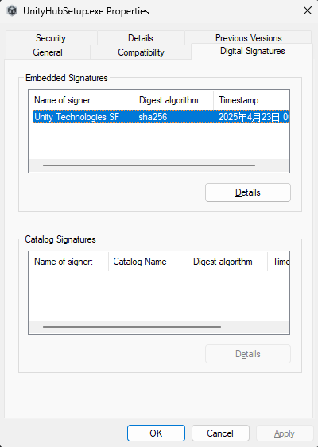

# unity-hub-setup-global

> Latest Version: 3.12.0.0 [Go 🔗](https://github.com/AaronW-BE/unity-hub-setup-global/releases/tag/3.12.0.0)

* Version: 3.12.0.0 
    * Windows: 
        [Link](https://github.com/AaronW-BE/unity-hub-setup-global/releases/download/3.12.0.0/UnityHubSetup.exe)
        Checksum: `14e95d1121ee54c6ff8e1501190febebc4298a018bfc189b71dd59c68b164ff5`
    * Mac
        [Link](https://github.com/AaronW-BE/unity-hub-setup-global/releases/download/3.12.0.0/UnityHubSetup.dmg)
---

### How to check if UnityHub is the international version on Windows

First of all, right click exe file on explorer window, and navigate tab to `digital signature`, then you can see the word like "Unity Technologies"

